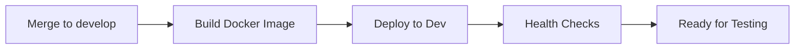

# Build and Release Guide

This guide explains how to build and release code through our GitHub workflow system, from development through to production.

## 🎯 Overview

Our release process follows a **build-once, deploy-many** strategy:

1. **Code merge** → `develop` branch triggers automated build + dev deployment
2. **Manual promotion** → Staging deployment using built image
3. **Manual promotion** → Production deployment using same image

## 📋 Quick Reference

| Environment     | Trigger                   | Build Required | Approval Required |
| --------------- | ------------------------- | -------------- | ----------------- |
| **Development** | Auto (merge to `develop`) | ✅ Yes (new)   | ❌ No             |
| **Staging**     | Manual (workflow)         | ❌ No (reuse)  | ❌ No             |
| **Production**  | Manual (workflow)         | ❌ No (reuse)  | ✅ Yes            |

---

## 🔄 Step 1: Development Release (Automatic)

### How It Works

When you merge code to the `develop` branch, two workflows automatically run:

1. **Build Docker Image** → Creates new image with tag like `1.45.2-abc123def` (also overrides the `latest` tag)
2. **Deploy Infrastructure + Application** → Deploys to dev environment

### What Happens



### Monitoring Your Development Release

-   📊 **GitHub Actions**: Monitor build progress in the Actions tab
-   🌐 **Dev Environment**: https://dev-api.hyperchonk.com
-   🏥 **Health Check**: https://dev-api.hyperchonk.com/health
-   📋 **GraphQL Playground**: https://dev-api.hyperchonk.com/graphql

### If Development Build Fails

1. Check the **GitHub Actions** logs for error details
2. Common issues:
    - **Build failures**: TypeScript errors, dependency issues
    - **Deployment failures**: Infrastructure problems, health check timeouts
3. Fix the issue and push to `develop` again

---

## 🚀 Step 2: Staging Release (Manual)

### When to Release to Staging

-   ✅ Development deployment is healthy and tested
-   ✅ Features are ready for QA validation
-   ✅ Ready for production-like environment testing

### How to Deploy to Staging

#### `Deploy Code Only`

1. Go to **Actions** → **Deploy Code Only**
2. Click **Run workflow**
3. Select:
    - **Environment**: `staging`
    - **Image tag**: Use the tag from dev deployment
4. Click **Run workflow**

### Finding the Right Image Tag

**Method 1: From Dev Deployment**

-   Go to the successful dev deployment in **Actions**
-   Look for "Image Tag: `1.45.2-abc123def`" in the job page

**Method 2: From ECR**

-   Check AWS ECR repository for recent tags
-   Use tags with format `version-gitcommit` (e.g., `1.45.2-abc123def`)

### Monitoring Staging Deployment

-   🌐 **Staging Environment**: https://staging-api.hyperchonk.com
-   🏥 **Health Check**: https://staging-api.hyperchonk.com/health
-   📋 **GraphQL Playground**: https://staging-api.hyperchonk.com/graphql

---

## 🎯 Step 3: Production Release (Manual + Approval)

### When to Release to Production

-   ✅ Staging deployment is healthy and QA approved
-   ✅ All tests are passing
-   ✅ Ready for customer-facing release
-   ✅ **Business approval obtained**

### How to Deploy to Production

#### `Deploy Code Only` workflow

1. Go to **Actions** → **Deploy Code Only**
2. Click **Run workflow**
3. Select:
    - **Environment**: `production`
    - **Image tag**: Use the **same tag** from staging
    - **Confirmation**: Type exactly `DEPLOY TO PRODUCTION`
4. Click **Run workflow**

### Production Deployment Features

-   🏷️ **Auto-tagging**: Creates `prod-latest`, `prod-previous`, and timestamped tags
-   🔍 **Enhanced health checks**: Validates deployment success
-   📊 **Detailed monitoring**: Infrastructure status validation

### Monitoring Production Deployment

-   🌐 **Production Environment**: https://api.hyperchonk.com
-   🏥 **Health Check**: https://api.hyperchonk.com/health
-   📋 **GraphQL Playground**: https://api.hyperchonk.com/graphql

---

## 🛠️ Troubleshooting Common Issues

### Build Failures

**Problem**: Docker build fails or times out
**Solutions**:

-   Check for TypeScript compilation errors
-   Verify dependency versions in package.json
-   Look for failing unit tests

### Deployment Health Check Failures

**Problem**: Deployment appears successful but health checks fail
**Solutions**:

-   Check Grafana or CloudWatch logs for application errors

### Infrastructure Stuck Stacks

**Problem**: CloudFormation stacks get stuck during deployment
**Solutions**:

-   Use **Actions** → **Fix Stuck CloudFormation Stacks**

### Wrong Image Deployed

**Problem**: Deployed wrong version to environment
**Solutions**:

-   Redeploy with correct image tag using **Deploy Code Only**
-   For production rollback: Use `prod-previous` tag

---

## 🎪 Advanced Workflows

### Hotfix Process

1. **Branch**: Create hotfix branch from `develop` branch
2. **Build**: Manually trigger **Build Docker Image** workflow on hotfix branch
3. **Deploy**: Use new image tag to deploy directly to production (emergency only)

### Rollback Process

**Quick Rollback** (Production):

```bash
# Use the previous production image
Image Tag: prod-previous
```

**Specific Version Rollback**:

1. Find desired image tag from ECR or previous deployment
2. Use **Deploy Code Only** with that specific tag

### Custom Image Tag Deployment

You can deploy any existing image tag to any environment:

1. Go to **Deploy Code Only** workflow
2. Enter specific image tag (e.g., `1.42.0-xyz789abc`)
3. Select target environment

---

## 📊 Best Practices

### For Developers

-   ✅ **Test locally** before merging to `develop`
-   ✅ **Monitor dev deployment** after merge
-   ✅ **Use descriptive commit messages** (they appear in image tags)
-   ✅ **Keep changes small** for easier rollback

### For QA Engineers

-   ✅ **Wait for dev health checks** before testing
-   ✅ **Test on staging** before production approval
-   ✅ **Document test results** for production release approval
-   ✅ **Verify production deployment** after release

### For DevOps/Release Managers

-   ✅ **Use same image tag** across staging → production
-   ✅ **Monitor infrastructure health** during deployments
-   ✅ **Keep production deployment windows** during business hours
-   ✅ **Maintain rollback readiness** for critical releases

---

### Environment URLs

-   **Development**: https://dev-api.hyperchonk.com
-   **Staging**: https://staging-api.hyperchonk.com
-   **Production**: https://api.hyperchonk.com

### GitHub Workflows

-   **Build Docker Image**: Creates new image from any branch
-   **Deploy Code Only**: Fast deployment using existing image
-   **Deploy Infrastructure + Application**: Full deployment with infrastructure updates
-   **Fix Stuck CloudFormation Stacks**: Emergency infrastructure recovery

---

## ❓ FAQ

**Q: Can I deploy to production without going through staging?**  
A: Technically yes, but it's strongly discouraged. Always test on staging first.

**Q: What if I need to deploy the same code to production twice?**  
A: Use the same image tag. The system handles duplicate deployments gracefully.

**Q: How do I know which version is currently in production?**  
A: Check the `/health` endpoint. It exposes both the code version and git sha and the infrastructure code version and git sha.

**Q: Can I deploy while another deployment is running?**  
A: You can trigger the workflow in github, but only one active deployment per environment is allowed. This is on purpose because having more than one CDK deployment active at any one time against an environment leads to unknown results.

**Q: What's the difference between the two deployment workflows?**  
A: "Infrastructure + Application" will update AWS resources if there were any changes made in the CDK code, "Code Only" just updates the application code.
